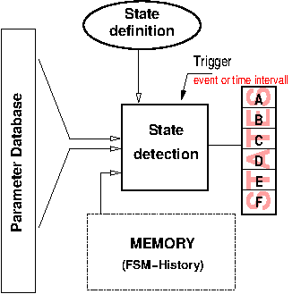
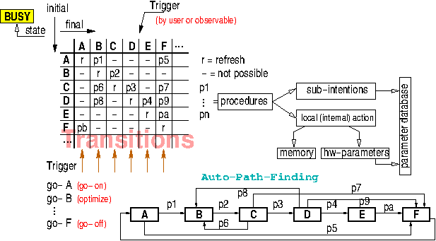
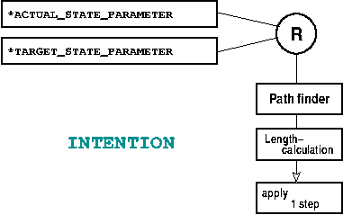
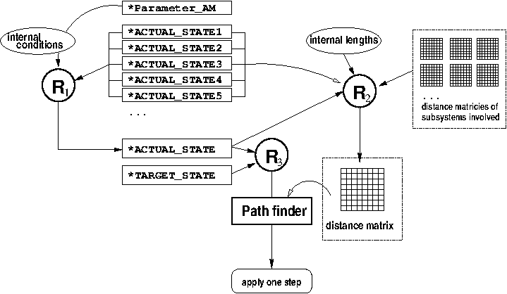

## Automation 

for MQTT Hyperdash V.1.02 (c) by Markus Hoffmann 
(concept studie from 2010)

Based on [rule engines](MQTT-rule-engine-howto.md) an automation concept can
be describes which theoretically leads to a fully autonomous entity of machines, 
all connected to each other via the MQTT framework.

The rule engines allow to crate any level of 
abstraction on the raw data and thus reduce the complexity of the individual
signals as well as maintainig actual/measured states the subsystems are to 
be in. A strong distinction between setpoint- and actual-measured values is 
essential here (actual value vs. target value).
 Both are supported by the 
[MQTT-Hyperdash naming convention](MQTT-dashgen-naming-conventions.md).

In particular, however, they are also suitable for generating status displays
for a higher-level system from a set of other, more subordinate status
parameters: e.g. the state "The power supply is switched on and ready" can be
generated from a series of individual messages from the individual power supply
units and current or power measurements. A well-designed system also allows you
to identify a number of fault conditions yourself. For this purpose, the
hardware usually already provides error bits that can be evaluated accordingly.

A total status for a subsystem or even the entire area can be derived from the
sum reports (with the help of the rule machines). This is an essential task of
the control systems and helps the surgeon to get an overview before having to
deal with all details and individual messages for troubleshooting, for example.

The prerequisite here, however, is that each individual component down to the
hardware level must also generate adequate control signals which permit such a
complete determination of the state. The criteria for the design of (new)
hardware components must be aligned accordingly.

In addition to the pure state detection, there must also be a way to change the
state of a system in a targeted manner (e.g. switching on a previously switched
off power supply or switching on an entire subsystem including its
conditioning).

So, directed rule engines allone cannot map the processes and algorithms to
really automate the  system. Therefor we have to introduce another extended
class of rules, called "Intentions". Intentions can be iplemented as rule
engines with some additional special state parameters. However we want to look
at them from a different perspective at first.

### "Intentions" for process automation

A "complete system" provides the functionality to reach every state in a
targeted manner. This cannot be realized in practice. However, it is
practicable that all relevant operating states can be reached, and at least for
a number of "errors" or "exceptions" which occur outside the normal
functionality, the error state can be left again for a normal operating state.

If this is not guaranteed, the system comes into a state where manual
intervention (if necessary with a screwdriver or programming tool) is
unavoidable. This stands in the way of (complete) automation of the overall
system. For this reason, as much expert knowledge as possible about
troubleshooting, conditioning, operational sequences, etc. must be made
available as a functionality. This happens on the lowest level (near the
hardware) and on all levels above, up to the highest level, where ideally only
one switch chooses between the states "On" and "Off".

In order to achieve this full automation, not only rules must be created that
reliably recognize all states, but also regulations/procedures to achieve
desired states (so-called "intentions"). These are usually instructions to the
subsystems, which occur in a specific order and vary depending on the state of
the system that has already been reached. 

The abundance of instructions for all components of the overall system to
achieve a normal operating state can quickly become confusing and ultimately
very inflexible. It is therefore important to create a system and an
implementation framework in which the automation in a hierarchy can be carried
out as context-locally as possible with individual, clear instructions.

Large procedures are to be factored into smaller sub-steps where possible, then
an automatism can ultimately also find detours in the overall procedure if a
originally planned route (due to e.g. the failure of a subsystem; sudden
change in status at one point) can no longer be committed. Possibly, the
higher-level status can still be achieved in this way, even though there is a
deviation from the standard procedure.

With the appropriate formulation of the individual tasks, a large part of the
compositions can already be done dynamically and therefore automatically. This
goal is to be achieved by the concept presented here.

#### Observables

Observables are system parameters from which a state can be derived using a rule
or a set of rules. This process is also called quantization of the
multidimensional and continuous real state space.

The measured values stored in parameters, e.g. from an ADC card to which
temperature sensors are connected, are observables for the thermal state of a
device. This state can be, depending on the measured temperatures, e.g. "too
cold", "correct", "too warm" or "critically hot".

An observable can also be a state of another system on which that system
depends. Ultimately, observables should be based on measured values and
enable statements to be made about the condition of the device to be checked.

Expressions of desire of the operator, e.g. an entered numerical value, could
also be regarded as an observable (looking at the human as a "device"), but this
is not particularly useful in this concept.

#### States 

A (complete) set of n states is defined for each system (e.g. "on", "off" and
"broken"). For this set, a status parameter (integer) is kept ready in the
control system and a rule machine maps (starting from a series of observables)
to this parameter (see Figure). This ensures that the actual status of the
system - based on the respective status record - is known at all times.

Figure: Actual states are derived from observables using a set of rules. The
observables can also include a history which is stored in the memory or is also
available as a parameter in the parameter database.

Determining meaningful states is a non-trivial matter and is usually done by the
person who developed the system or who knows it best. The states can be defined
in different ways, but it must always be ensured that the abstract states
clearly reflect the operating state of the device. A state "undefined" is also a
state in the strictest sense, but hardly anything can be derived from such a
state, in particular nothing that leads to an automatic finding of a state
appropriate to the function (e.g. "ready for operation").

It is also possible to define several sets of states that are complete in
themselves (i.e. represent a partition of the entire state space), e.g. "On" and
"Off", as well as "ready for operation" and "faulty", but where conditions from
one of the records may overlap. Each set of states must be reflected in its own
parameter.

#### State changes and Transitions

A change of state can happen on its own, e.g. by the failure of a system, by
reaching a temperature threshold or by the expiry of a preheating time or by
other physical processes which are detected by the diagnostic system.

Secondly, these physical processes can also be triggered by the diverse control
functions. In this case, an action has resulted in a transition from state A to
state B. Each action, on the other hand, can in turn be given by an intention,
whereby we want to understand intention as the desired target state combined
with a procedure that should lead to that target state from theoretical
understanding (and hopefully also practically, if the system works as intended).
However, whether the condition is reached is not guaranteed (however, this
should be the case if the system functions normally). This can be verified or
falsified by observing the detected actual state, which correspond to the intendet state.
If they are different, action need to be taken.

Figure: Transition matrix from one state (initial) to another (final) and the
various possible and impossible actions. The path to a desired final state can
be found automatically.

The problem of automation can now be summed up quite simply, independently of
the complexity of the system and regardless of the number of subsystems
involved:

<pre>

The following applies to all systems: 
If the system is not in the desired state, 
it will do nothing more than (permanently) by itself 
try to get into this state.

</pre>

The system automatically waits for a (possibly system-external) condition to
occur and then continues. If the state can be reached automatically, it will be.
Otherwise, manual intervention is usually required (with a screwdriver). Then
either the hardware is physically broken and has to be repaired or replaced, or
there is no automatic procedure for this fault situation that can bypass or
remedy the fault. This procedure would then have to be retrofitted.

No other case can occur in a system for which all relevant observables have been
provided. So it should not happen that operating the system (manually, but with
the functionality provided) only continues if external information (e.g.
evaluating an oscillograph image) is used to make a decision. If the latter is
the case with a system, the design of the system in question has to be rethought
and a new measurement signal may have to be installed so that automatic operation
(only then) becomes possible.

All in all, this process of continuous improvement, if resolved consistently,
should ultimately lead to complete automation, with all of the knowledge about
the operation of the individual components gradually being incorporated into the
control system software framework (from which it can then be extracted, for
example, for documentation purposes).

What is important is a framework and a language in which the implementation can
be carried out as easily as possible. As many people as possible should be able
to contribute. A large part of the process should already take place
automatically in a standardized way according to defined rules. The knowledge
then only has to be poured into simple rules that only describe formalized
transitions or actions. In their overall direction, these automatically allow
the automation of the entire system. The detailed knowledge from the lower level
subsystems  should not be needed for the higher hierarchical
level.

Rules and intentions are closely related. In fact, an action associated with an
intention is intended to reverse the rule machine graph. If a rule is a pure
conversion formula, an inverse function can easily be defined if necessary. Most
of the rules associated with state detection are only surjective (quantization)
and are no longer injective. A clear reversal function cannot therefore be
specified. However, control and regulation tasks can usually still be solved by
iteration, in which case an (optimal) initial state is selected and found from
all possible ones that lead to the same final state.

If the directed graph of the rules projects upwards from the observables to a
state, the chained intentions represent a reversal of the direction from top to
bottom. This direction is usually more difficult to achieve, and the rules for
this are also more complicated, since they must contain knowledge of how it
works and an expectation of the likely behavior of the system (usually from a
model or a (physical) theory). However, since these models can only access
quantized information that is disturbed by the measurement accuracy, they have
to make certain assumptions that are not guaranteed to, but probably must, apply.
There are therefore "good" and "bad" procedures, in the sense that the former
are more likely to achieve the desired goal. This is the reason for the
particular difficulty in automation.

#### Implementing Intentions

Figure: How an intention works in the automation framework.

with rule engines using pairs of parameters (setpoint and ismeasured values)

#### Internal Actions

#### Mixed Actions

### Intentions with autonomous path length calculations

(Why it is better not to use sequences).

Illustration: Intention with autonomous path length calculation: Rule R2 always
knows the path lengths from the current state to all possible other states that
can be reached. In the form of a distance matrix, these are also made known to
all other intentions as parameters. These in turn recalculate their lengths accordingly.
Rule R1 is used to determine the current status and rule R3 monitors changes in
the target state and in the actual state and if necessary, apply a step from the
shortest path heading the target state.

### Distinguishing: free and non-free states and parameters

### Avoiding contradictions in the rule machinery

### Consequences

### A path finder

