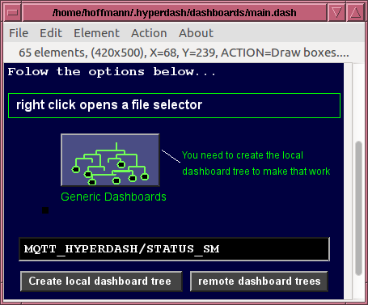

## MQTT Hyperdash Dashdesign 

for MQTT Hyperdash V.1.03 (c) by Markus Hoffmann

MQTT Hyperdash runs so-called dash-files. Dash-files are simple text files, 
consisting of UTF-8 encoded ASCII text. They can be edited by any text editor, or
by the special application "dashdesign" which comes with the 
MQTT-Hyperdash package.

dashdesign is a graphical editor for these dashboards. 

The graphic editor is used to select and arrange static and dynamic elements and
their assignment to MQTT parameters in a dashboard. This editor can create
elements, position them individually or in groups on a dashboard, move them and
provide them with various attributes (colors, fonts, line thicknesses, etc.).
Active elements can be "bound" to one or more MQTT parameters. Most elements are
available in different display variants (e.g. three different types of pointer
instruments) and can therefore be adapted to different tasks.

It is also common to first let hddashgen generate a generic dashboard from the
list of topics and then edit these dashboards with dashdesign. This way all buttons
are already there and bound to the MQTT topics and one need only rearrange them so
that the dashboard looks nicer and serves more the specific needs of the operators.

A typical work-flow may be: 

* File -> Load ... a .dash file or
* File -> New  create a new one.
* Element -> select an element you want to place to the workspace
* Drag with the mouse where that should go
* If you need to move it: Action -> Move Element
* If you need to change any properties of an element: 
  Edit --> Edit Properties ... and click on an element to edit. 
  
You can change the Broker: Edit -> Edit Broker ..., or the Colors 
Action -> Set Colors, or topic or font the same way.

When done, you can save the .dash file and run it with 
File -> Run Dashboard.

Maybe instead of placing individual base elements one by one, you can try out the
Element groups collection by selecting Groups -> something

All this is designed to be easy to use. If you cannot find out how to 
change some special properties, you will always have the option to save
the .dash file, open it with your favorite text editor, change something 
(reading the [MQTT-Hyperdash file format specification](MQTT-Hyperdash-file-format.md) ), 
save it and open it again in dashdesign to see the result. 

If you want to move or copy a group of elements, you can place a COMPOUND 
element on top of the group. By moving the compound, all elements fitting inside
the compound area will move together. 

