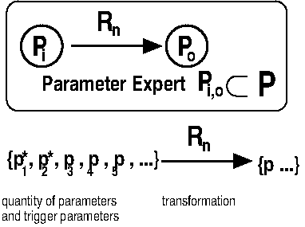
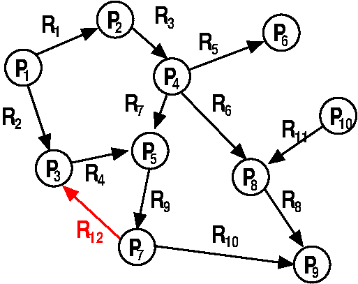

## MQTT Rule Engines

Here we summarize briefly what rule engines are and how you can nicely implement
abstraction layers into your data and how you can build a distributed and 
scalable computation based on the MQTT data.

### Introduction

Rule engines are meant to be applications running completely in the background. 
They do not interact directly with the user. Their function is to subscribe to a
set of topics, watch their updates and trigger a routine, which calculates 
something based on the input topics and finally publish the result(s) to output
topics,  which then can trigger other rules or rule engines. They also can
perform actions on the machine they are running, like executing shell scripts
when a topic content matches a certain pattern. 

A rule is a transformation algorithm together with a set of 
input parameters (topics) and a set of output parameter. A Subset of the input
parameters can trigger the algorithm calculation. The rule is triggered when 
the content of such an input trigger topic has changes. A rule algorithm is 
calculated in no time (which means, the algorithm must not yield or halt its
execution and must process as fast as possible.)

A rule engine is a process running on any computer connected to the broker, 
which can execute one or more rules. 

With multiple rule engines running even on different computers using the same
broker, one can implement a full automation control, which would create the
Internet of Things. 

All rules together form a rule network, or a rule graph.

Usually this graph is a directed graph, so that all calculations always come 
to an end. 

If the graph has cycles, this would mean, that the rules will trigger 
themselves. Except for special cases, the rule graph must be designed to not
have unintended cycles, otherwise the parameters have undefined values and
the whole rule subgraph becomes unstable. 

However, If you can make sure, that the cycle will always come to an end, e.g. 
when the algorithm as a whole converges on the input parameters, then a cycle 
might be an interesting concept to implement (slow) control loops for the 
automation.

The concept of rule engines is not new and can be found in other automation
concepts as well. This implementation is focused on high performance quick
reaction, and reliability. Using them is not very complicated. 

### MQTT-Hyperdash rule engines

MQTT-Hyperdash provides a framework with which you can very quickly define 
and program rule engines. You only need to specify the main code fraction 
of your algorithm, and the framework will take care of collecting all data
trigger your routines and publish the results. For the rule itself the data 
is available as if they are in normal variables to calculate with. No 
communication overhead need to be programmed. 

You can make tree different base kinds of rule engines:

1. An engine which will be triggered on a set of topics changes and then 
   perform any action an the local machine (interact with the hardware, 
   perform switching tasks, execute external programs or shell scripts, or
   simply log the data and write them to a file or database. 

2. An engine which performs measurement tasks in a loop and publishes the
   measured results to the MQTT-Network. The rule itself need perform the 
   measurement code, access the hardware, do calculations. The results are 
   stored in a data area and the framework takes care of publishing it. 

3. An engine which waits for triggers from a set of input topics, use even more
   topics data (without been triggered by it) and then calculate something. The
   results are stored in a data area and the framework takes care of 
   publishing it. All data is transparently available to the rule itself 
   as if it was normal variable content. 

And of course any grade of mixture of these three base concepts. 

There are four example rules provided with this package to demonstrate the usage
in any of these cases:

* sysmeasure.rule
* syslogger.rule
* commander.rule and 
* demo.rule. 

### The framework

The rule engine framework, with which the rule programmer will not come in touch
subscribes to all TOPICs defined and collects permanently all data which
arrives. If a trigger TOPIC gets a message, a snapshot of all data available at
that time on every TOPIC defined is collected into a snapshot and the rule
function is executed. The results are expected to be stored in the snapshot and
finally the framework publishes the content of the defined OUTPUT TOPICs, 
but only, if the content has changed! If the rule comes to the same results, 
it will not get published again, because there is a retained value with the 
same content. This saves network bandwidth and hinders other rules to be 
triggered with the same input again and again. 

### Quick Guide: demo.rule

You want to have a look at src/demo.rule. This es everything needed to implement
and make a simple rule. The rule will be compiled into a native executable with

<pre>
make demo
</pre>

The file demo now can be executed, but it should not print anything to the
terminal console, because besides debug messages there is no direct output or
input via the console. 

If you see an error message, make sure that you run a broker on the 
machine (localhost) and that the access rights are correct.

You can as well execute demo in the background, e.g.
like this:

<pre>
./demo 2>&1 >> /tmp/demo.log &
</pre>

I have put mine in the crontab, so the automatically start at boot 
(on a Raspberry pi):
<pre>
@reboot /home/pi/bin/demo  2>&1 > /dev/null
</pre>

#### The magic

The magic not happens in the background. To see, what happens, 
please open three terminal windows.

In Window number 1 please run 
<pre>
 mosquitto_sub -h localhost -t DEMO/ACTIVITY_DM 
</pre>

If demo is running, you should see an update here every second counting from 0
to 3. This indicates that the demo engine is running. (Maybe you want to make 
a dashboard, and put DEMO/ACTIVITY_DM to a BITMAPLABEL ...)

Now open Window number 2 and run
<pre>
 mosquitto_sub -h localhost -t DEMO/C 
</pre>

and windows number 3 and enter

<pre>
  mosquitto_pub -h localhost -t DEMO/A -m 12
  mosquitto_pub -h localhost -t DEMO/B -m 10
</pre>

You should find the results update in window number 2. 

Thats magic. Now you should be creative and think what you 
can to with this mechanism. 

I do
* calculate the filling percentage of a battery out of the voltage measured
* Do a rescaling of values from mSv/d to µSv/h.
* Have shell commands executed on a remote machine whenever I press a Button on
  a MQTT-Hyperdash dashboard.
* Recalculate and rescale the data for a plot in a dashboard whenever the 
  user sets a different scaling for X or Y.

The rule engines consume nearly no CPU power, they are so fast, that changes are
instantly trigger calculations on the fly. 

### Writing own rules

You should take demo.rule as a template and modify it according to your needs.

The rule syntax is C with some predefined macros. Rule files are actually C 
files and they are  compiled with gcc. SO you can add any sub-function you 
need for calculation. And the stdlib including math is readily available. 

This way the execution of the rule function can be very fast, but there are 
nearly no limitations.

For advanced use, the rule definitions allow an initialization functions which 
is called once at startup of the rule engine executable and can pass
command-line parameters, ask for environment variables or open configuration
files, if needed. The demo rule does not make use of it.

<pre>
typedef struct {
  PARMDEF *params; /* The List of parameters/topics */
  int numparms;    /* Number of parameters defined*/
  void (*initrule)(); /* The initialization rule */
  void (*rule)();     /* The trigger rule */
} RULEDEF;
</pre>

Initrule gets the parameters (argc,argv) from the main function.
Parameters are defined using this struct:

<pre>
typedef struct {
  int type;     /* Type of the parameter, a combination of 
                   PARM_IN PARM_TRIGGER PARM_OUT PARM_ISNUMBER*/
  char *topic;  /* The topics name */
  int qos;      /* The Quality of Service to be used for 
                   subscription and publication*/
  int sub;      /* In index to the subscription table, initialize with 0*/
  char *format; /* A format string to format floating point numbers to 
                   the topics content, BASIC like or printf-like */
} PARMDEF;
</pre>

Maybe interesting is the qos parameter. It can make sense to set it to 2 in cases
where the trigger must not get lost and must occur not more than once. 
However this slows the rules down quite a lot. 

If you have questions or problems using this framework, please feel free to 
discuss this in the Issues forum of this repository.

